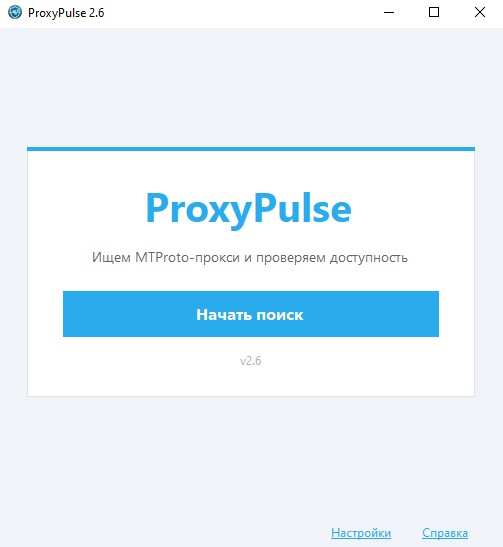

<p align="center">
  
</p>

<p align="center">
  <strong>Поиск MTProto-прокси и проверка доступности</strong><br>
  Подключение в Telegram одним кликом · Windows · без VPN и API-ключей
</p>

<p align="center">
  <a href="https://github.com/VorozhbitDM/ProxyPulse-MTProto-for-TG/releases/latest"></a>
  <a href="LICENSE"></a>
  <a href="https://dotnet.microsoft.com/download/dotnet-framework/net472"></a>
  
  <a href="https://github.com/VorozhbitDM/ProxyPulse-MTProto-for-TG/releases"></a>
</p>


---

## Возможности

Telegram иногда недоступен напрямую. В каналах и архивах публикуют MTProto-прокси, но вручную искать, проверять задержку и копировать `secret` неудобно.

**ProxyPulse** делает это за вас:

- собирает прокси из общедоступных источников (лимит настраивается, по умолчанию 100);
- проверяет **доступность** (TCP, с таймаутом);
- сортирует по задержке;
- открывает выбранный прокси в **Telegram** одним кликом.

---


<details>
<summary><strong>Скриншоты</strong></summary>

<br>

| Стартовый экран | Результаты поиска |
|:---:|:---:|
|  |  |

</details>

---

## Быстрый старт

1. Скачайте и запустите [ProxyPulse.exe](https://github.com/VorozhbitDM/ProxyPulse-MTProto-for-TG/releases/latest).
2. Нажмите **«Начать поиск»**.
4. Кликните по прокси в списке — Telegram предложит подключение.

### Настройки

Внизу окна — **«Настройки»**.

| Параметр | По умолчанию | Описание |
|----------|--------------|----------|
| **Лимит прокси** | `100` | Сколько уникальных прокси собрать за один поиск (от 10 до 500). |

Значение сохраняется в `%AppData%\ProxyPulse\settings.txt` и подхватывается при следующем запуске.

На экране поиска: **«Сбор… N из 100»** — число справа берётся из настройки. Проверяются все собранные прокси; **«Найдено M»** — сколько из них оказались доступными.

### Требования

| | |
|---|---|
| ОС | Windows 10 / 11 |
| Runtime | [.NET Framework 4.7.2+](https://dotnet.microsoft.com/download/dotnet-framework/net472) (часто уже установлен) |
| Telegram | Установленный Telegram Desktop или из Microsoft Store |

---

## Сборка из исходников

```powershell
git clone https://github.com/VorozhbitDM/ProxyPulse-MTProto-for-TG.git
cd ProxyPulse-MTProto-for-TG
.\build.ps1
```

Готовый файл: `dist\ProxyPulse.exe` и архив `dist\ProxyPulse-v2.7-win-x64.zip` (внутри только exe).

Нужен [.NET SDK](https://dotnet.microsoft.com/download) (для сборки) или MSBuild + .NET Framework 4.7.2.

---

## Поддержка и развитие проекта

<p align="center">
  <a href="https://yoomoney.ru/to/4100119536071248">
    
  </a>
</p>

Проект с открытым исходным кодом. Если ProxyPulse вам помог — буду благодарен любой сумме.

---

## Лицензия

[MIT](LICENSE) — используйте и распространяйте свободно с указанием авторства.

---

<p align="center">
  <a href="https://github.com/VorozhbitDM">Denis Vorozhbit</a> ·
  <a href="https://github.com/VorozhbitDM/ProxyPulse-MTProto-for-TG">ProxyPulse-MTProto-for-TG</a>
</p>
