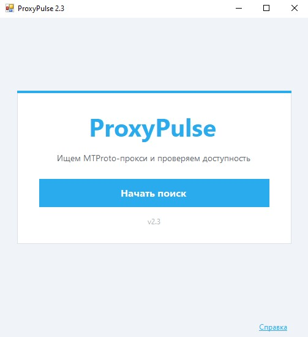
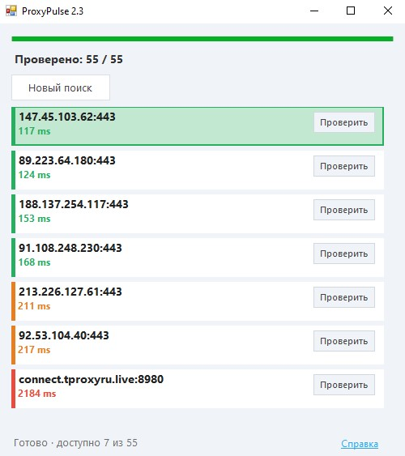

# ProxyPulse

**Поиск MTProto-прокси и проверка доступности** — одним кликом подключение в Telegram. Без VPN, без API-ключей и без ручной настройки.

[](LICENSE)
[](https://dotnet.microsoft.com/download/dotnet-framework)
[](https://github.com/VorozhbitDM/ProxyPulse-MTProto-for-TG)

---

## Возможности

Telegram иногда недоступен напрямую. В каналах и архивах публикуют MTProto-прокси, но вручную искать, проверять задержку и копировать `secret` неудобно.

**ProxyPulse** делает это за вас:

- собирает прокси из общедоступных источников;
- проверяет **доступность** (TCP, с таймаутом);
- сортирует по задержке;
- открывает выбранный прокси в **Telegram** одним кликом.

---

## Скриншоты

**Стартовый экран**



**Результаты поиска** — список доступных прокси с пингом и цветовой индикацией



---

## Быстрый старт

1. Скачайте **`ProxyPulse-v2.3-win-x64.zip`** из [Releases](https://github.com/VorozhbitDM/ProxyPulse-MTProto-for-TG/releases).
2. Распакуйте архив и запустите **`ProxyPulse.exe`** (один файл, без dll).
3. Нажмите **«Начать поиск»**.
4. Кликните по прокси в списке — Telegram предложит подключение.

### Требования

| | |
|---|---|
| ОС | Windows 10 / 11 |
| Runtime | [.NET Framework 4.7.2+](https://dotnet.microsoft.com/download/dotnet-framework/net472) (часто уже установлен) |
| Telegram | Установленный Telegram Desktop или из Microsoft Store |

---

## Сборка из исходников

```powershell
git clone https://github.com/VorozhbitDM/ProxyPulse-MTProto-for-TG.git
cd ProxyPulse-MTProto-for-TG
.\build.ps1
```

Готовый файл: `dist\ProxyPulse.exe`

Нужен [.NET SDK](https://dotnet.microsoft.com/download) (для сборки) или MSBuild + .NET Framework 4.7.2.

---

## Поддержать проект

Проект бесплатный и с открытым исходным кодом. Если он вам помог — можно поддержать разработку любым удобным способом:

| Способ | Ссылка | Комментарий |
|--------|--------|-------------|
| **Boosty** | *добавьте ссылку* | Удобно для аудитории из СНГ, рубли |

---

## Лицензия

[MIT](LICENSE) — используйте и распространяйте свободно с указанием авторства.

---

## Автор

[Denis Vorozhbit](https://github.com/VorozhbitDM) · репозиторий: [ProxyPulse-MTProto-for-TG](https://github.com/VorozhbitDM/ProxyPulse-MTProto-for-TG)
